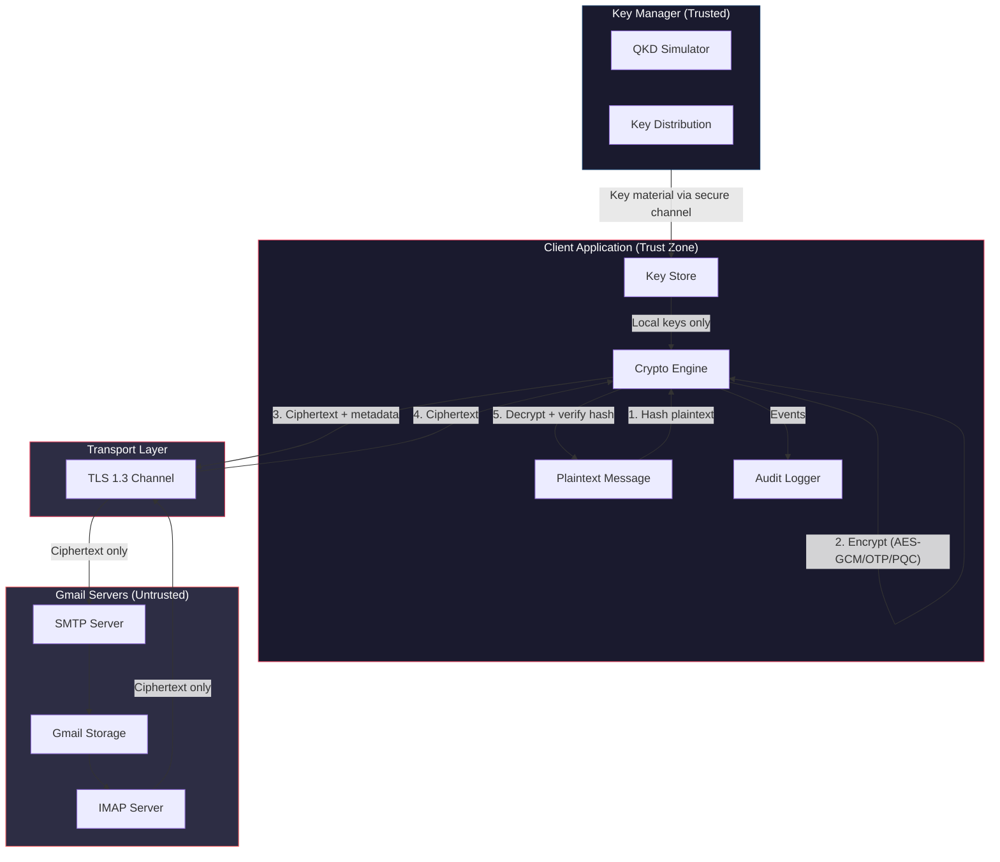

# QuMail Security Analysis

## Architecture & Trust Boundaries



### Trust Boundary Explanation

| Zone | Trust Level | Has Access To |
|------|------------|---------------|
| **Client Application** | Full trust | Plaintext, keys, hashes |
| **Key Manager** | Trusted | Key material only |
| **Transport (TLS)** | Semi-trusted | Ciphertext in transit |
| **Gmail Servers** | **Untrusted** | Ciphertext only, never plaintext or keys |

**Critical invariant**: Encryption keys are **never** transmitted to or stored on Gmail servers.

---

## TLS vs Application-Layer Encryption

| Property | TLS (Transport Layer) | QuMail E2E (Application Layer) |
|----------|----------------------|-------------------------------|
| **Encryption point** | Network socket | Application code, before network |
| **Decryption point** | Network socket | Application code, after retrieval |
| **Server access to plaintext** | ✅ Yes (after TLS terminates) | ❌ No (server sees ciphertext) |
| **Protection at rest** | ❌ No | ✅ Yes |
| **Protection against server compromise** | ❌ No | ✅ Yes |
| **Protection against insider threat** | ❌ No | ✅ Yes |
| **Key management** | Certificate authorities | User-controlled local keys |
| **Verifiable by user** | Partially (cert pinning) | ✅ Yes (hash comparison, MIME inspection) |

### Why Both Are Needed

TLS protects data **in transit** — preventing network eavesdropping. Application-layer encryption protects data **at rest and from the server** — Gmail cannot read the email content even if compelled by a court order, hacked, or operated by a malicious insider.

---

## Threat Model

### Threats Mitigated

| Threat | Attack Vector | QuMail Defense |
|--------|---------------|----------------|
| **Server Compromise** | Attacker gains access to Gmail storage | Ciphertext only; no keys on server |
| **Man-in-the-Middle** | Intercepting network traffic | TLS + application-layer encryption (double protection) |
| **Insider Risk** | Gmail employee reads email | Cannot decrypt without client-side keys |
| **Legal Compulsion** | Government subpoena to Google | Google can only produce ciphertext |
| **Ciphertext Tampering** | Modifying email in transit/storage | AES-GCM authentication tag detects modification |
| **Key Reuse Attack** | Same key for multiple messages | Fresh nonce per message; OTP uses one-time keys |
| **Replay Attack** | Re-sending captured ciphertext | Unique nonce + key_id per message |

### Residual Risks

| Risk | Severity | Mitigation |
|------|----------|------------|
| Client device compromise | **High** | Hardware security modules, OS-level protections |
| Key manager compromise | **Medium** | Separate service, minimal attack surface |
| Side-channel attacks | **Low** | Constant-time hash comparison, standard crypto libraries |
| Metadata analysis | **Medium** | Subject line encrypted, but To/From visible (SMTP requirement) |
| Quantum computing (future) | **Low** | Level 3 PQC (Kyber/Dilithium) provides quantum resistance |

---

## Encryption Pipeline

```
plaintext
    │
    ├── SHA-256(plaintext) → integrity_hash
    │
    ├── AES-GCM-256 Encrypt (key, nonce) → ciphertext + auth_tag
    │   └── Key derived from QKD material via HKDF
    │
    ├── Build JSON Envelope: {ciphertext, nonce, tag, key_id, integrity}
    │
    ├── Base64 encode → encrypted_body
    │
    ├── Build MIME message with encrypted_body
    │   └── Subject → "[QuMail Secure]" (original hidden)
    │   └── X-QuMail-* headers for metadata
    │
    └── Send via SMTP/TLS → Gmail stores ciphertext only
```

## Decryption Pipeline

```
Gmail IMAP → retrieve MIME message
    │
    ├── Parse MIME → extract encrypted_body + metadata
    │
    ├── Base64 decode → JSON envelope
    │
    ├── Extract: ciphertext, nonce, tag, key_id
    │
    ├── Retrieve key via key_id from Key Manager
    │
    ├── AES-GCM-256 Decrypt (key, nonce, tag) → plaintext
    │   └── Auth tag verification (tamper detection)
    │
    ├── SHA-256(plaintext) → decrypted_hash
    │
    ├── Verify: decrypted_hash == original integrity_hash
    │   └── PASS → message authentic
    │   └── FAIL → tampering detected
    │
    └── Return plaintext to UI
```

---

## E2E Encryption Proof Methodology

### Proof 1: Gmail Stores Ciphertext Only
- Send an encrypted email
- In Gmail web UI, click "Show Original" on the received message
- The MIME body contains only base64-encoded ciphertext
- The original subject and body are NOT present

### Proof 2: Tampering Detection
- Encrypt a message
- Modify 1 bit of the ciphertext
- Attempt decryption → **fails** with authentication error
- AES-GCM's 128-bit authentication tag is cryptographically bound to the ciphertext

### Proof 3: Hash Comparison
- Compute `SHA-256(plaintext)` before encryption
- Encrypt → transmit → decrypt
- Compute `SHA-256(decrypted_text)`
- Assert: `original_hash == decrypted_hash`

### Proof 4: Network Inspection
- Use Wireshark or browser DevTools to inspect network traffic
- Observe: only ciphertext leaves the client application
- The plaintext exists only in memory within the client process

---

## Limitations

1. **Metadata exposure**: SMTP requires visible sender/recipient addresses; subject is encrypted but To/From are not
2. **Key exchange bootstrap**: Initial key exchange requires a trusted channel (Key Manager)
3. **Client-side security**: If the endpoint device is compromised, all bets are off
4. **No forward secrecy** (Level 2): Compromising a session key reveals that session only; implementing Diffie-Hellman ECDHE would add forward secrecy
5. **Single-device keys**: Currently keys are per-device, not per-user across devices
