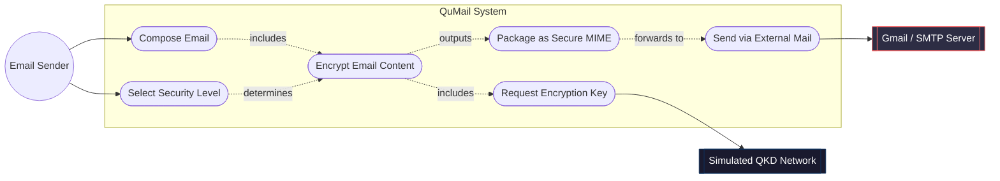
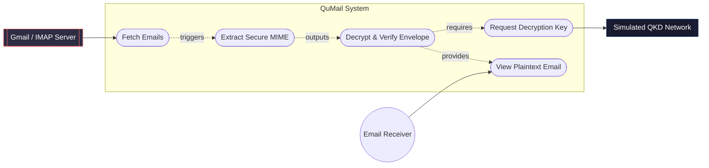
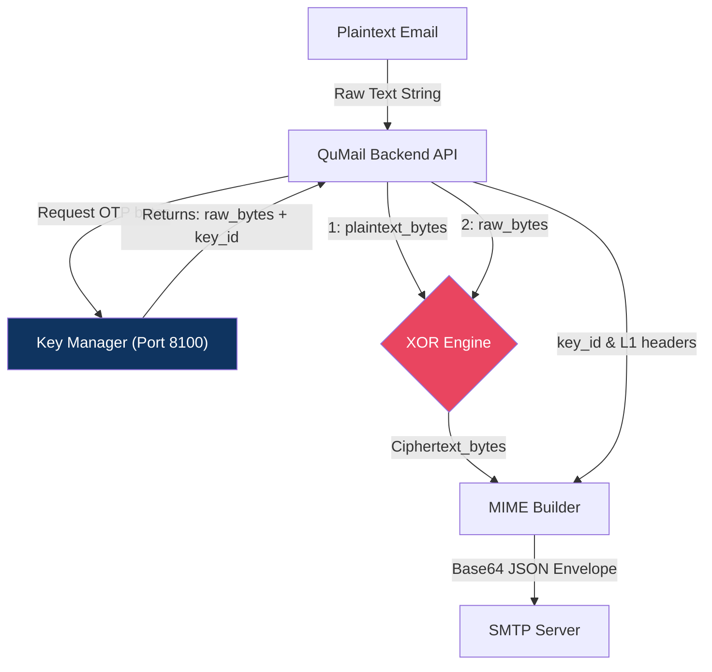
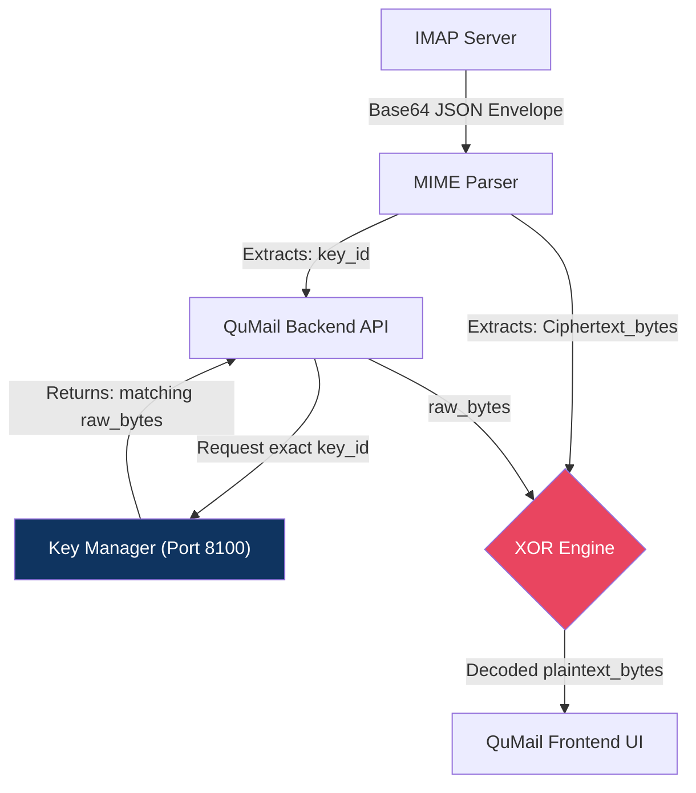
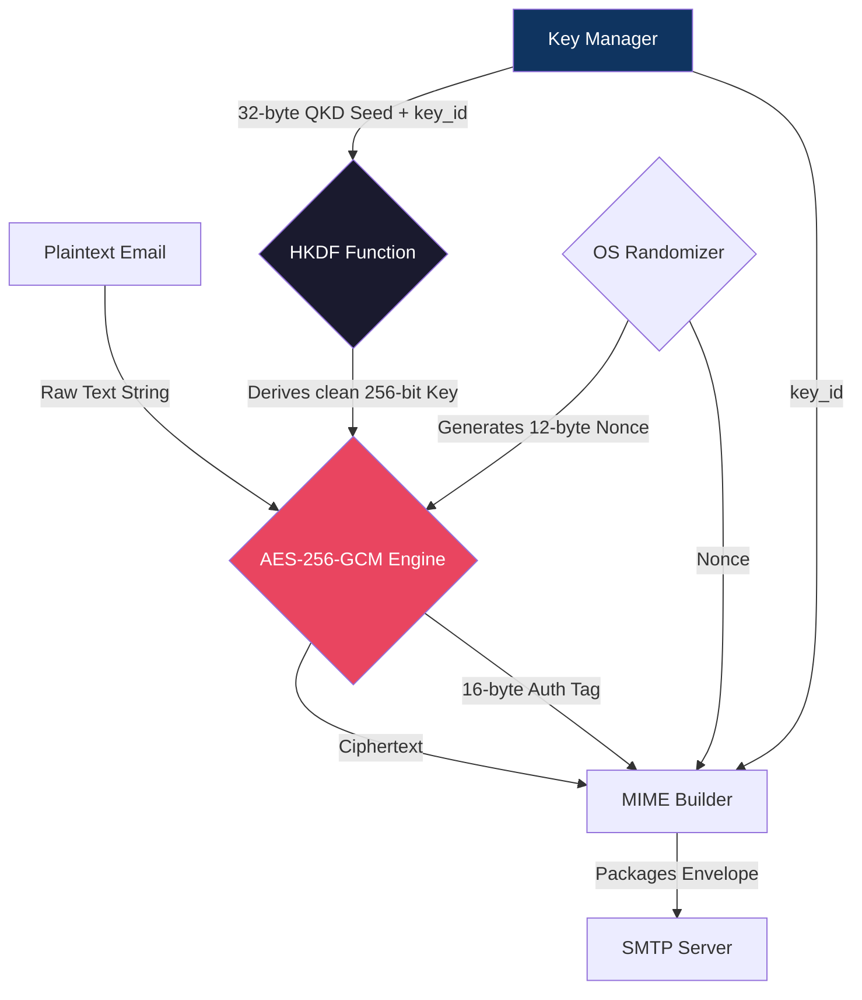
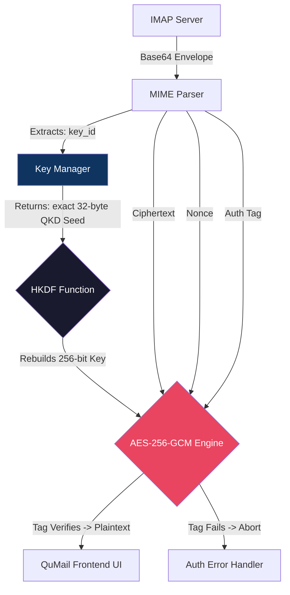
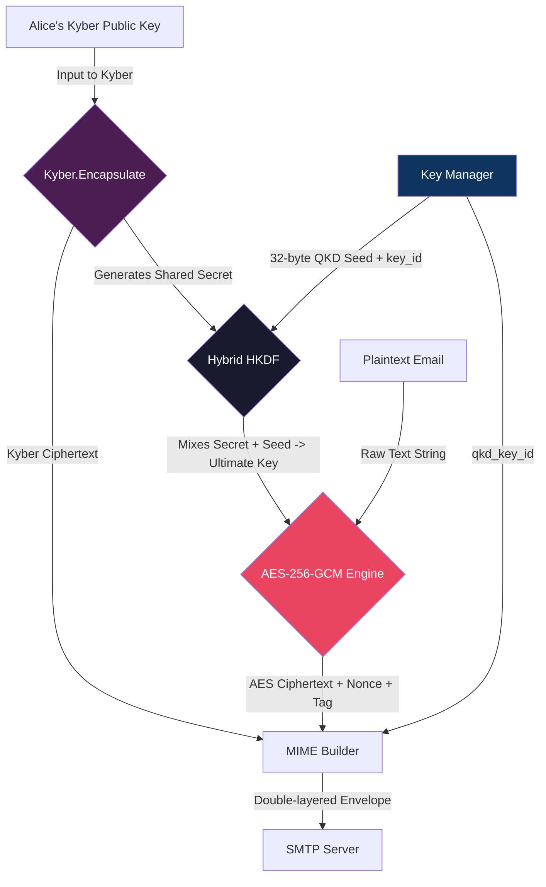
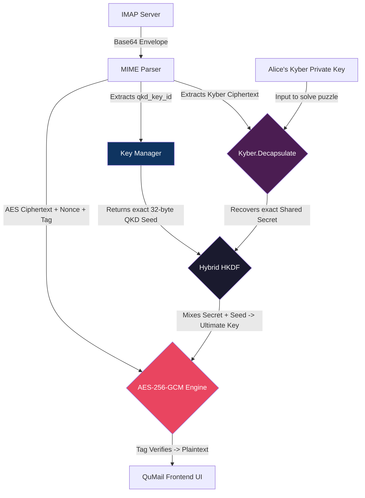

# QuMail Security Visual Diagrams

This document contains both Data Flow Diagrams and Use Case Diagrams for the QuMail security architecture.

## 1. Use Case Diagrams

Use Case diagrams show the interactions between Actors (users or external systems) and the QuMail system.

### Sender Use Cases

### Receiver Use Cases

---

## 2. Updated Security Data Flow Diagrams

Here are the detailed data flow diagrams with precise Sender and Receiver flows for all three security levels.

### Level 1: Quantum Secure OTP

#### L1 Sender (Encryption) Flow

#### L1 Receiver (Decryption) Flow

---

### Level 2: Quantum-Aided AES

#### L2 Sender (Encryption) Flow

#### L2 Receiver (Decryption) Flow

---

### Level 3: Post-Quantum Crypto (Hybrid)

#### L3 Sender (Encryption) Flow

#### L3 Receiver (Decryption) Flow

