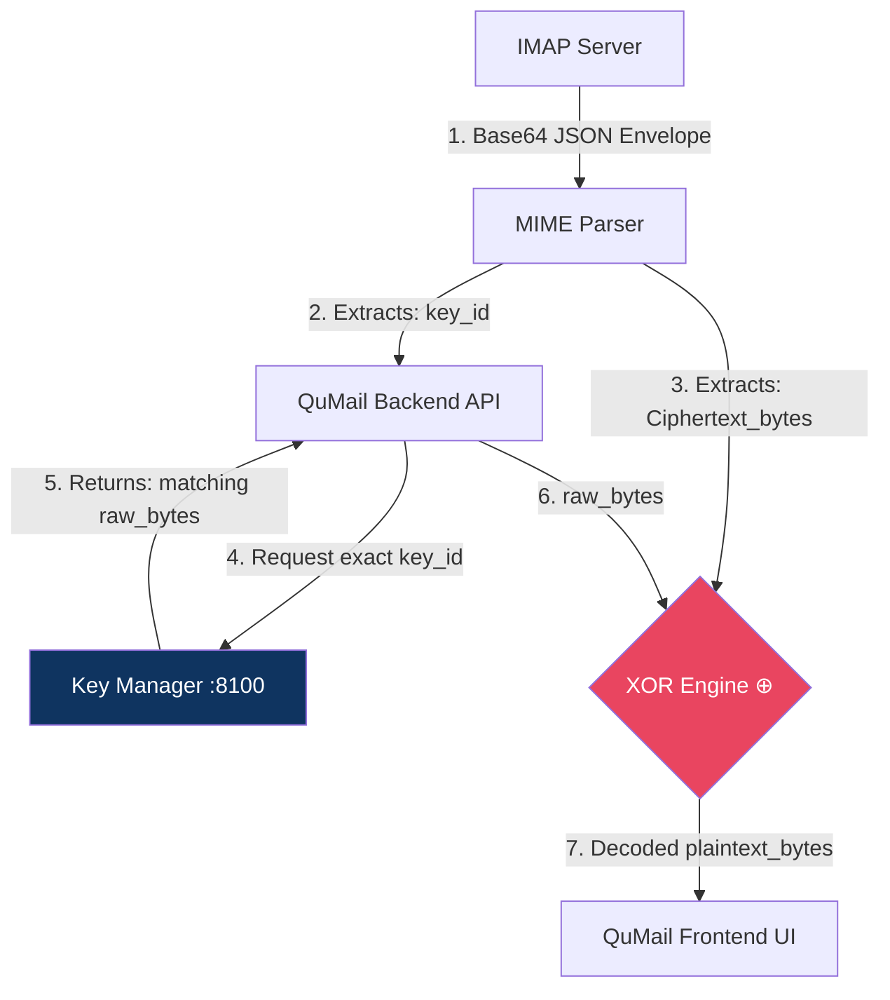
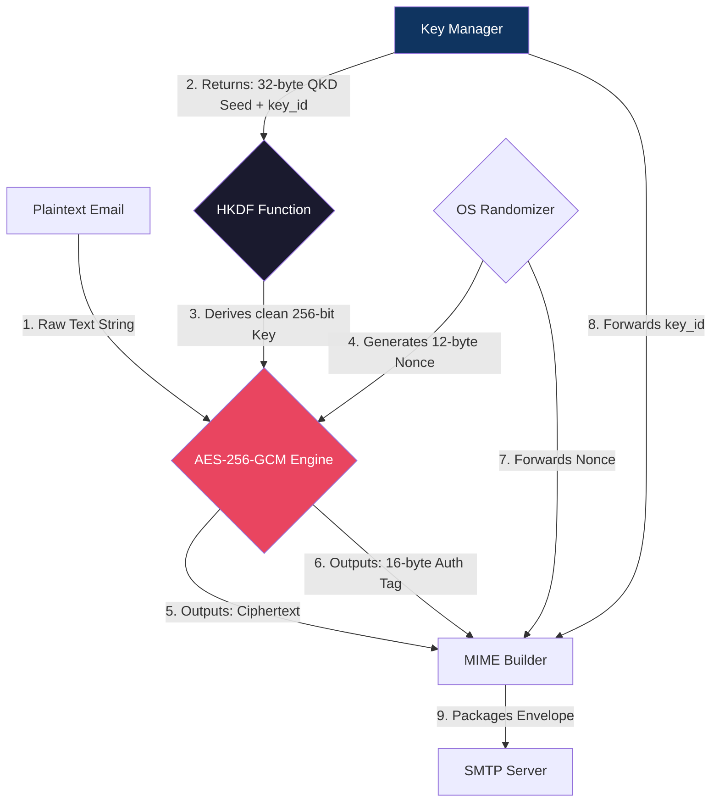
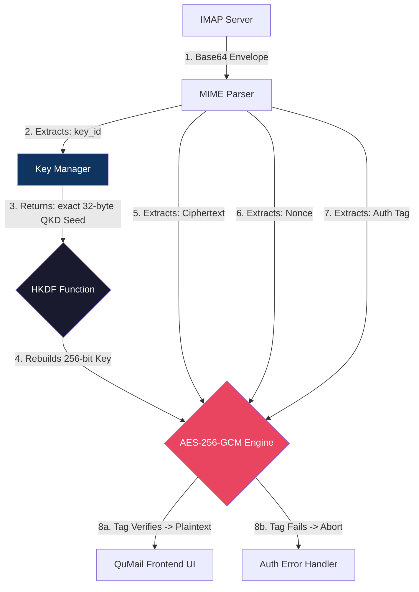
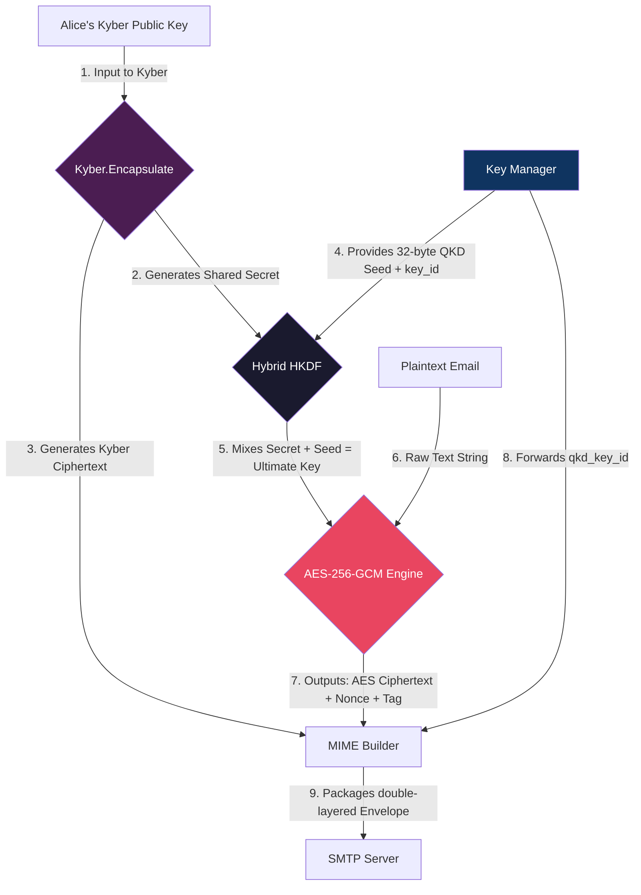

# QuMail Security Data Flow Diagrams

This document outlines the exact data flow between components during the encryption (Sending) and decryption (Receiving) processes for all three QuMail security levels.

## Level 1: Quantum Secure OTP
The purest form of encryption. Data flows straight from the QKD Key Manager directly into a bitwise XOR operation against the plaintext.

### Sender (Encryption) Flow
```mermaid
flowchart TD
    %% Components
    PT[Plaintext Email]
    KM[Key Manager :8100]
    API[QuMail Backend API]
    XOR{XOR Engine ⊕}
    MIME[MIME Builder]
    SMTP[SMTP Server]
    
    %% Data Flow
    PT -->|1. Raw Text String| API
    API -->|2. Request OTP bytes = len(text)| KM
    KM -->|3. Returns: raw_bytes + key_id| API
    
    API -->|4. plaintext_bytes| XOR
    API -->|5. raw_bytes| XOR
    
    XOR -->|6. Ciphertext_bytes| MIME
    API -->|7. key_id, L1 headers| MIME
    
    MIME -->|8. Base64 JSON Envelope| SMTP
    
    %% Styling
    style XOR fill:#e94560,color:#fff
    style KM fill:#0f3460,color:#fff
```

### Receiver (Decryption) Flow


## Level 2: Quantum-Aided AES
The standard mode. Data flows from the Key Manager into an HKDF to derive a clean session key, which is then fed into the AES-GCM block cipher.

### Sender (Encryption) Flow


### Receiver (Decryption) Flow


## Level 3: Post-Quantum Crypto (Hybrid)
The most complex flow. It combines a lattice-based Key Encapsulation Mechanism (Kyber) with QKD material to create a double-layered hybrid key.

### Sender (Encryption) Flow


### Receiver (Decryption) Flow

